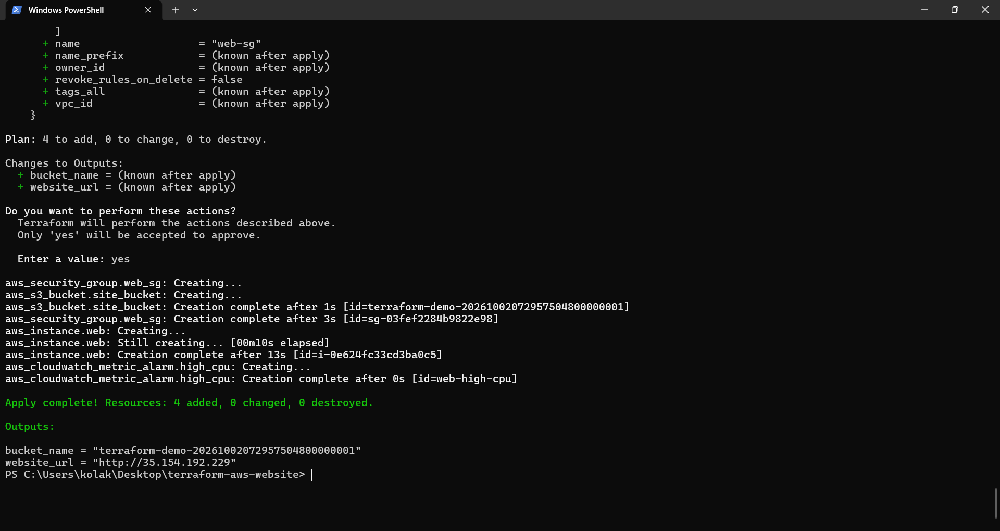
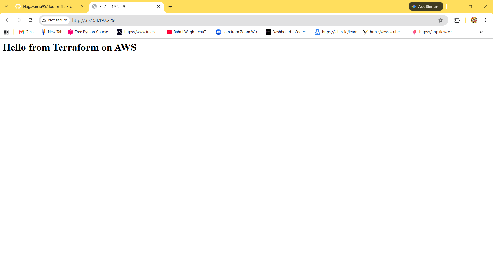
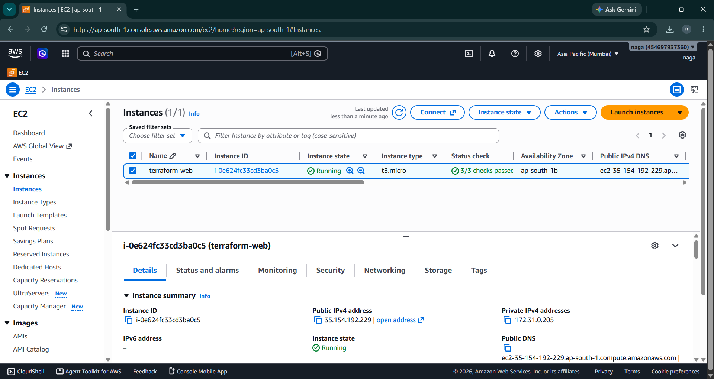
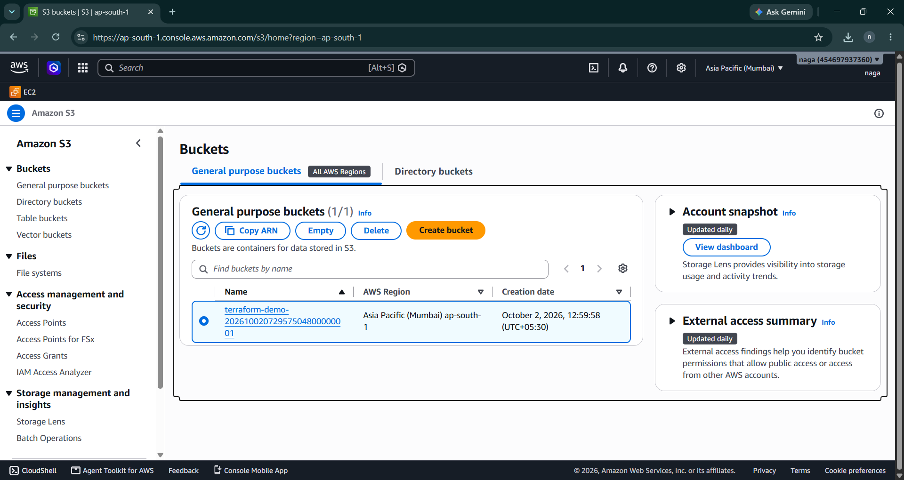
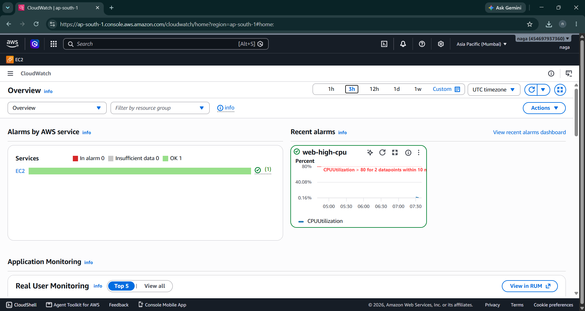

# Website Deployment on AWS using Terraform

Terraform code that builds a small web server on AWS. The server installs Nginx automatically when it starts and serves a simple web page.

## What it creates

- A security group that allows HTTP traffic on port 80
- An EC2 instance (t3.micro, Amazon Linux 2023) that installs Nginx at launch with a user-data script
- An S3 bucket
- A CloudWatch alarm that watches CPU usage (above 80 percent)

## How to run it

Terraform and the AWS CLI must be installed, and AWS credentials configured.

    terraform init
    terraform plan
    terraform apply

Open the website_url shown in the output (use http, not https).

To delete everything and avoid charges:

    terraform destroy

## Screenshots

